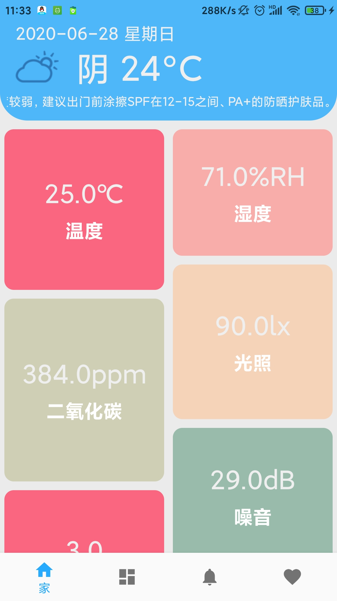
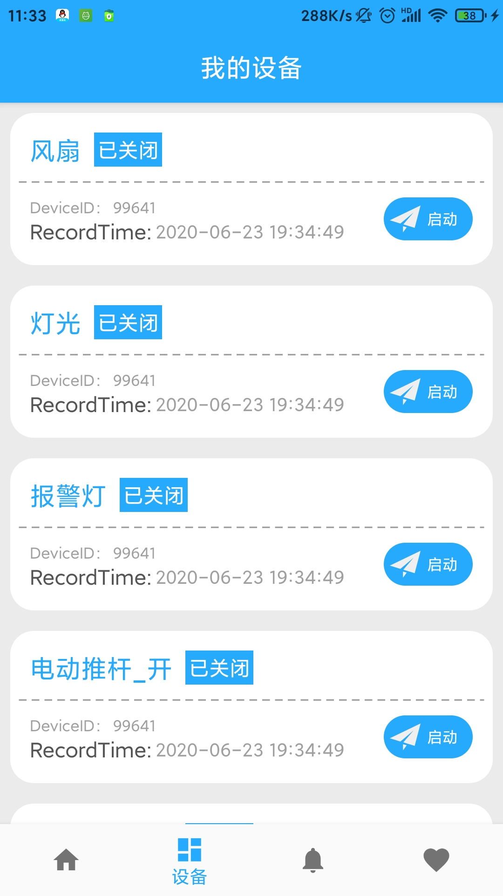
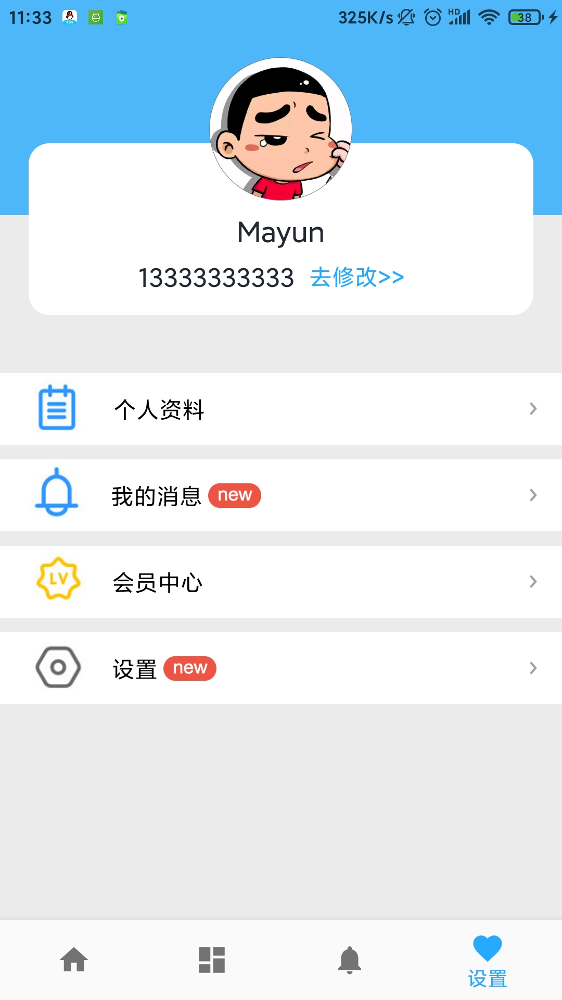

### SmartHomeOnNlecloud-master

- 基于[新大陆物联网云平台](http://www.nlecloud.com/doc/api/)，智能家具 APP

#### 部分截图：

#### 用到的框架：

- 沉浸式封装： compile 'com.gyf.barlibrary:barlibrary:2.2.6'
- 轮播图封装： compile 'cn.bingoogolapple:bga-banner:2.1.7@aar'

#### 感谢：

 基于 GitHub 大神的[SmartHome](https://github.com/xuhongv/SmartHome)项目改写。

